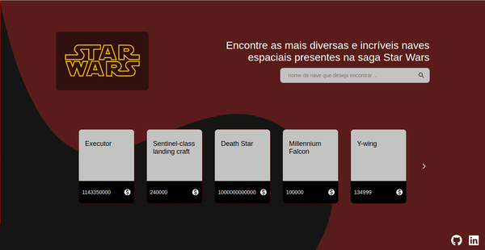

   

## Nata.house technical test

This repository was made as a technical test created by **nata.house** company for a javascript developer job.

### Challange

   

Consists in create a application that display how many stops are necessary to a starship complete a journey.

Using the public [Star Wars API](https://swapi.co/), to integrate with the application.

---

### Application

Was developed a application that list all starships presents on starwars films, and for each starship you can see more details about it and calculate **how many stops are necessary to complete a journey** with any distance provided by user.

   

Is important say that I never saw any star wars film before, so I don't understand nothing about this universe.

---

Created with love by Raphael ❤️
